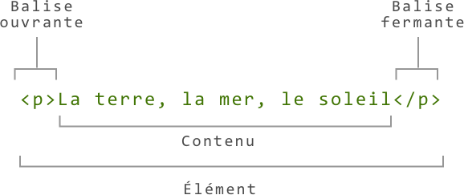
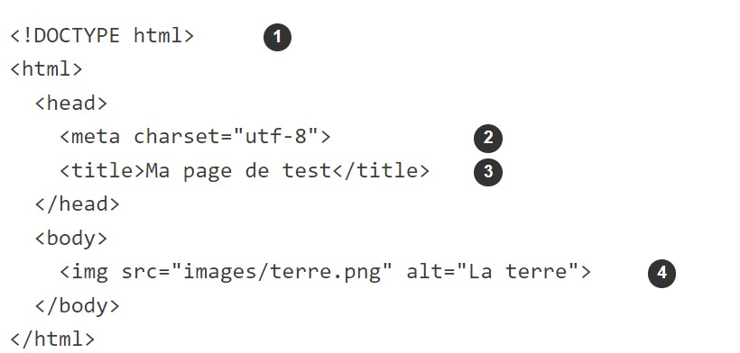

# Structure d'un document HTML


## 1) Langage de balisage

+ **`HTML` n'est pas un langage de programmation. C'est un langage de balisage qui définit la structure du contenu. `HTML` se compose d'une série d'éléments, utilisés pour entourer les diverses parties du contenu et les faire apparaître ou agir d'une certaine façon.**

```
<p>Bonjour tout le monde !</p>
```

+ Il existe deux types de balises : 


#### 1) Balise de couple (pair) : `balise ouvrante et fermante`


+ **La balise ouvrante**

    + Celle-ci se compose du nom de l'élément (ici `p`), entre deux chevrons. Cela indique le début de l'élément, càd l'endroit à partir duquel celui-ci prend effet. Pour notre exemple, cela indique `le début du paragraphe`.


+ **La balise fermante**

    + Ici on a également des chevrons et le nom de l'élément, auxquels on ajoute une barre oblique avant le nom de l'élément. Cela indique la fin de l'élément. Pour notre exemple, cela indique `la fin du paragraphe`.


**syntaxe**




+ **Le contenu**

    + **C'est le contenu de l'élément, ici c'est simplement du texte.**

+ **L'élément**

    + **Il est composé de la balise ouvrante, de la balise fermante et du contenu.**

#### 2) Balise simple

+ **Syntaxe**

```
Bonjour <br> tout le monde! 
```


# Attributs d'un élément

+ **Les `attributs` contiennent des informations supplémentaires qui portent sur l'élément et qu'on ne souhaite pas afficher avec le contenu.**

+ **Par exemple, l'attribut `class` permet d'utiliser un nom pour identifier l'élément et ce nom pourra être utilisé plus tard pour la mise en forme ou autre chose.**

```
<p class="couleur-rouge">Boujour, tout le monde !</p>
```

#### Attributs d'un élément

+ Pour créer un attribut, il faut :

    + insérer un espace entre cet attribut et le nom de l'élément (ou l'attribut précédent, si l'élément possède déjà un ou plusieurs attributs)
    + donner un nom à l'attribut, puis ajouter un signe égal
    + donner une valeur à l'attribut, entourée par des guillemets d'ouverture et de fermeture


#### Attributs booléens
+ Un `attribut booléen` ne peut avoir qu'une seule valeur, généralement la même que le nom de l'attribut.

+ **Attribut disabled → booléen**

```
<input type="text" disabled="disabled">
```
+ **Syntaxe raccourcie**

```
<input type="text" disabled>
```

#### Imbriquer des éléments
+ On peut placer des éléments au sein d'autres éléments, c'est ce qu'on appelle l'imbrication.

```
<p>Bonjour, <strong>Monsieur</strong>John Doe</p>
```

### Éléments bloc vs en ligne
+ **Il existe deux catégories importantes d'éléments en HTML : `les éléments bloc et les éléments en ligne`.**

#### 1) Éléments bloc

+ Les éléments bloc forment un bloc visible sur une page — ils apparaissent sur une nouvelle ligne quel que soit le contenu précédant et tout contenu qui les suit apparaît également sur une nouvelle ligne.

+ Les éléments de niveau de bloc sont souvent des éléments structurels de la page et représentent, par exemple, des paragraphes, des listes, des menus de navigation, des pieds de page, etc.

+ **Un paragraphe est un élément bloc**

```
<p>Boujour, tout le monde.</p>
```


#### 2) Éléments en ligne

+ Les éléments en ligne sont contenus dans des éléments bloc. Ils entourent seulement des petites parties du contenu du document. Un élément en ligne ne fait pas apparaître une nouvelle ligne dans le document.

+ `<strong>` est un élément en ligne


```
<p>La terre, <strong>la mer</strong>, le soleil.</p>

```
#### Les éléments vides

+ Certains éléments n'ont pas de contenu. Ces éléments sont appelés éléments vides. C'est le cas par exemple de l'élément ``.

```

```
+ Cet élément contient deux attributs mais les balises ouvrante `` et fermante `</img>` sont remplacées par une balise auto-fermante `` et il n'y a aucun contenu interne. En effet, l'élément image n'embarque pas de contenu, son but est d'intégrer une image dans la page HTML, à l'endroit où l'élément est placé.


# Type d'attributs

#### 1) Global Attributes (Attributs globaux) :

+ `id`: Identifiant unique pour un élément.
+ `class`: Classe(s) pour une utilisation de CSS.
+ `style`: Styles en ligne pour un élément.
+ `title`: Texte supplémentaire (info-bulle).
+ `lang`: Langue de l'élément.


#### 2) Éléments liés aux liens :

+ `href`: URL de destination (utilisé avec les balises `<a>, <link>, <area>`).

+ `target`: Où ouvrir le lien `(_blank, _self, _parent, _top)`.

+ `download`: Indique au navigateur de télécharger le lien au lieu de le naviguer.


#### 3) Éléments de formulaire :

+ `action`: `URL` du script de traitement du formulaire.

+ `method`: Méthode `HTTP` pour envoyer les données `(GET ou POST)`.

+ `name`: Nom de l'élément de formulaire.

#### 4) Attributs d'entrée (Input) :

+ `type`: Type d'entrée (text, checkbox, radio, etc.).
+ `value`: Valeur par défaut.
+ `placeholder`: Texte indicatif (non saisi).
+ `required`: Indique que l'entrée est requise.

#### 5) Attributs multimédias :

+ `src`: Source de l'élément multimédia `(, <audio>, <video>)`.
+ `alt`: Texte alternatif pour l'image.
+ `width, height`: Dimensions de l'image.

#### 6) Attributs de tableau :

+ `colspan, rowspan`: Fusion de cellules dans un tableau.

#### 7) Attributs de script :

+ `src`: Source du script.
+ `async`: Exécution asynchrone.
+ `defer`: Reporte l'exécution du script jusqu'à ce que la page soit analysée.

#### 8) Attributs de style :

+ `type`: Type de style (text/css pour CSS).
+ `media`: Type de média auquel le style s'applique.

#### 10) Événements JavaScript :

+ `onclick, onchange, onsubmit, etc`.


# Structure de base d'une page HTML




1. `Le doctype` spécifie que l'on utilise la grammaire `HTML5`.
2. Spécifie le jeu de caractères utilisé
3. Le titre du document.
4. Le contenu de la page est placé dans l'élément `<body>`.


# Balises de mise en valeur

|Balises|Description|
|-------|-----------|
|`<strong>`|Cette balise est utilisée pour indiquer que le texte qu'elle entoure doit être fortement mis en valeur, généralement en le rendant gras.|
|`<em>`|Cette balise est utilisée pour indiquer que le texte qu'elle entoure doit être mis en valeur, généralement en l'italique.|
|`<mark>`|Cette balise est utilisée pour mettre en surbrillance une partie du texte.|
|`<ins>`|Cette balise est utilisée pour indiquer qu'un texte a été inséré dans le document.|
|`<del>`|Cette balise est utilisée pour indiquer qu'une partie du texte a été supprimée ou barrée.|
|`<abbr>`| Cette balise est utilisée pour définir une abréviation ou un acronyme.|
|`<cite>`|Cette balise est utilisée pour référencer le titre d'une œuvre, comme un livre ou un film.|
|`<q>`|Cette balise est utilisée pour indiquer une citation courte.|


# Quizz

#### Question 1 : Laquelle de ces syntaxes indique convenablement un commentaire HTML ?

```
<!--COMMENTAIRE-->
```

#### Question 2 : Quellebalise déclare une liste ordonnée ?

```
<ol></ol>
```

#### Question 3 : Quelle est la structure de base d'une page HTLM5?

```
<!DOCTOTYPE html>$
<html>
    <head>
    </head>
    <body>
    </body>
</html>
```


