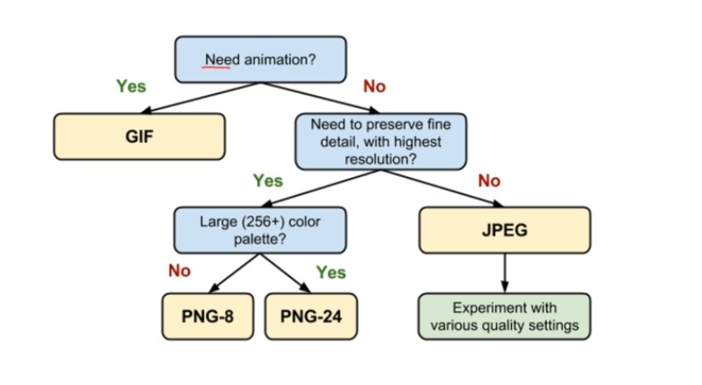

Section 5 : Ajouter des images
===


## Information
- Title:  `Ajouter des images`
- Authors:  `Etienne KOA`

## Types d'images



## Quizz

**Question 1**

+ Pour sépcifier aux moteurs de recherche ce que represente notre image, il est conseillé d'utiliser surtout l'attribut

```
        alt
```

**Question 2**

+ Pour spécifier une image d'illustration importante, on utilise : 

```
<figure>
    
</figure>
```


**Question 3 :**

+ Il est conseillé d'utiliser principalement une image :  

```
        jpg
```

