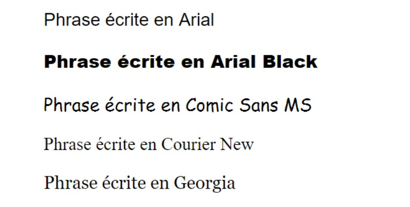
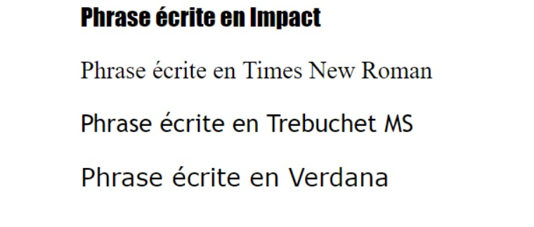

Section : Ajouter du code style avec CSS
===

## Information
- Title:  `Ajouter du code style avec CSS`
- Authors:  `Etienne KOA`


## Récapitulatif des sélecteurs

+ La sélection par la balise

```
p {}
```

+ La multi-sélection

```
h1, em { } 
````

+ La sélection par la classe

```
.class { } 
```

+ La sélection par l'ID

```
#id { } 
```


+ Le sélecteur universel (toutes les balises)

```
* { } 
```

+ La balise B contenue dans A

```
A B { } 
```

+ La balise a qui a un attribut title

```
a[title] { } 
```

+ La balise a qui a un attribut title qui a un valeur "Accueil"

```
a[title="Accueil"] { } 
```

+ La balise a qui a un attribut title dont le mot "Accueil" est en tout ou partie la valeur

```
a[title*="Accueil"] { } 
```

+ Toute la liste : https://www.w3.org/Style/css3-selectors-updates/WD-css3-selectors-20010126.fr.html#selectors

## Récapitulatif des polices de base




## Alignement du style de texte CSS

+ [Aligner proprement son texte](https://developer.mozilla.org/fr/docs/Web/CSS/list-style-type)

## Ajout de couleur

+ [Ajout de couleur personnalisée](https://www.flatuicolorpicker.com/#)
+ [Ajout de couleur personnalisée](https://g.co/kgs/dheoP4r)
+ [images gratuites](https://pixabay.com/)


## Recapitulatif des couleurs


+ Le site pour trouver des couleurs originales : http://www.flatuicolorpicker.com/

## Recapitulatif Bordure


## Quizz

**Question 1 :**

+ Comment écrire un commentaire en `CSS` ?

```
/* COMMENTAIRE */
```

**Question 2 :**

+ Comment déclare-t-on la classe "quizz" dans notre `CSS` ?

```
.quizz
```

**Question 3 :**

+ Quelle propriété utilisée pour changer la police d'un texte ?

```
font-family
```


## Directory Hierarchy
```
|—— design
|    |—— default.css
|—— index.html
|—— pictures
|    |—— bensound.mp3
|    |—— Etixi_logo.png
|    |—— favicon.png
|    |—— illustration_1.png
|    |—— illustration_2.jpg
|    |—— illustration_3.jpg
|    |—— illustration_4.jpg
|    |—— illustration_5.jpg
|    |—— illustration_6.jpg
|    |—— logo.png
|    |—— presentation.png
```
