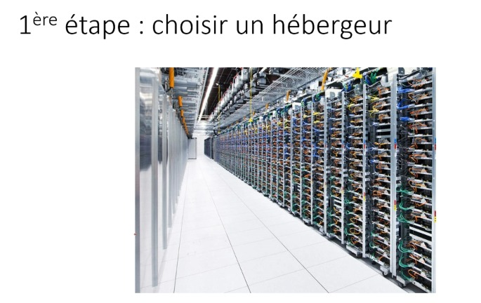
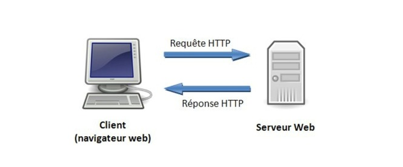
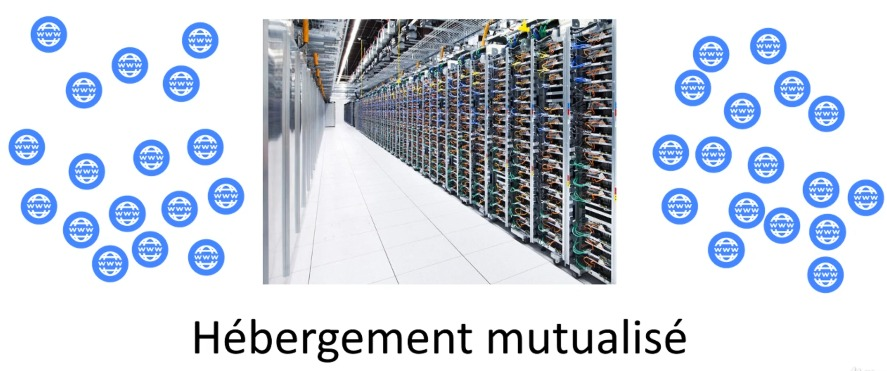
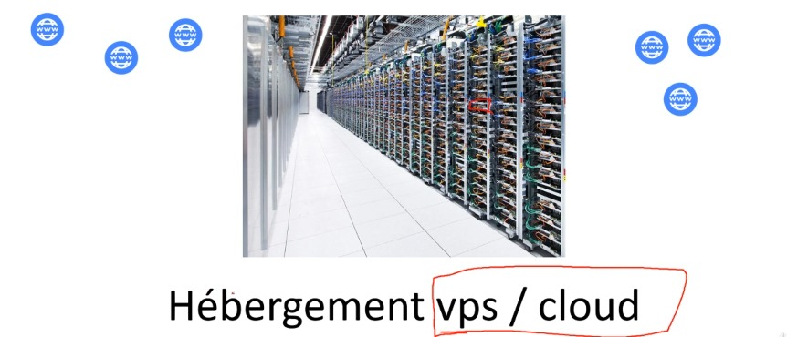
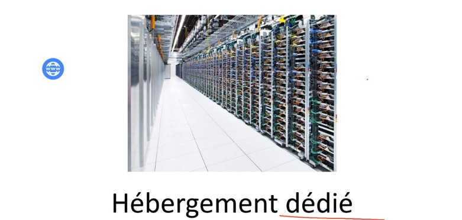
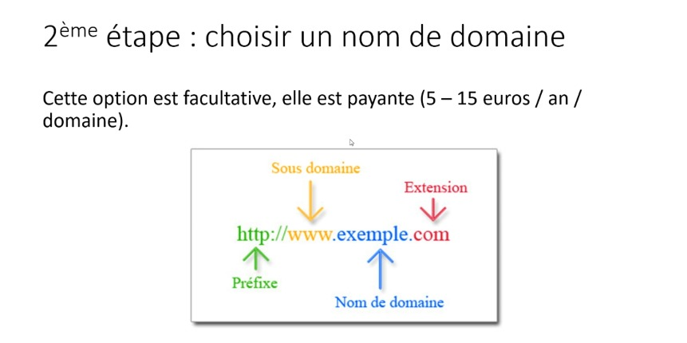

Section 15 : Optimiser et lancer notre site
===

## Information
- Title:  `Optimiser et lancer notre site`
- Authors:  `Etienne KOA`


## Etape Hébergement Site Internet













## Hébergement Site Internet

[000Webhost(gratuit)](https://fr.000webhost.com/)

[Ovh(payant)](https://www.ovhcloud.com/fr/)

[Le logiciel FTP: filezilla](https://filezilla-project.org/)


## Analyser nos visteurs grâce à Google Analytics

[Google Analytics](https://analytics.google.com/analytics/web/provision/#/provision)


## Quizz

**Question 1 :**
Google Analytics est un service de Google pour :

```
Voir le trafic surnotre site internet et gérer les tatistiques de pages vues
```

**Question 2 :**
Je suis limité sur le nombre de personnes qui peuvent aller sur mon site avec un simple serveur dédié ?

```
          Oui

Evidemment ! Google a des milliers de serveurs, s'ils n'en avaient qu'un, ils ne seraient jamais disponible.
```


**Question 3 :**
Les favicons sont obligatoires ?

```
          Non
```

## Directory Hierarchy
```
|—— design
|    |—— default.css
|—— firstproject.html
|—— images
|    |—— image1.jpeg
|    |—— image2.jpeg
|    |—— image3.jpeg
|    |—— image4.jpeg
|    |—— image5.jpeg
|    |—— image6.jpeg
|    |—— image7.jpeg
|—— index.html
|—— pictures
|    |—— bensound.mp3
|    |—— Etixi_logo.png
|    |—— favicon.png
|    |—— illustration_1.png
|    |—— illustration_2.jpg
|    |—— illustration_3.jpg
|    |—— illustration_4.jpg
|    |—— illustration_5.jpg
|    |—— illustration_6.jpg
|    |—— logo.png
|    |—— presentation.png
|—— src
|    |—— theblacklist.ttf
```
